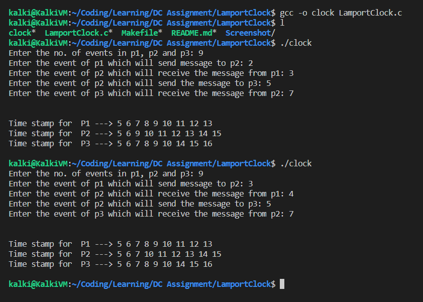

# Distributed Computing - Assignment - Lamport Clock
This is the Task 2 of the DC Assignment 1 - BITS WILP 3rd Sem

## Setup
In Ubuntu 18.04 OS, install gcc, make, rpcgen and rpcbind with the following commands
```bash
sudo su
apt update
apt install -y gcc make
```

## Development
* Run `make clean` to wipe all binary executable files.
* Then, run `make` to build Lamport clock executable file.
* Run `./clock` to start the clock and fill the data in the prompt shown.
* Then, the timestamp for the processes will be shown.

## Screenshots

